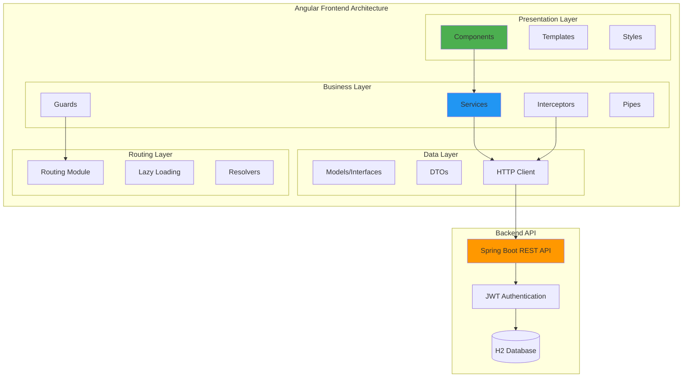
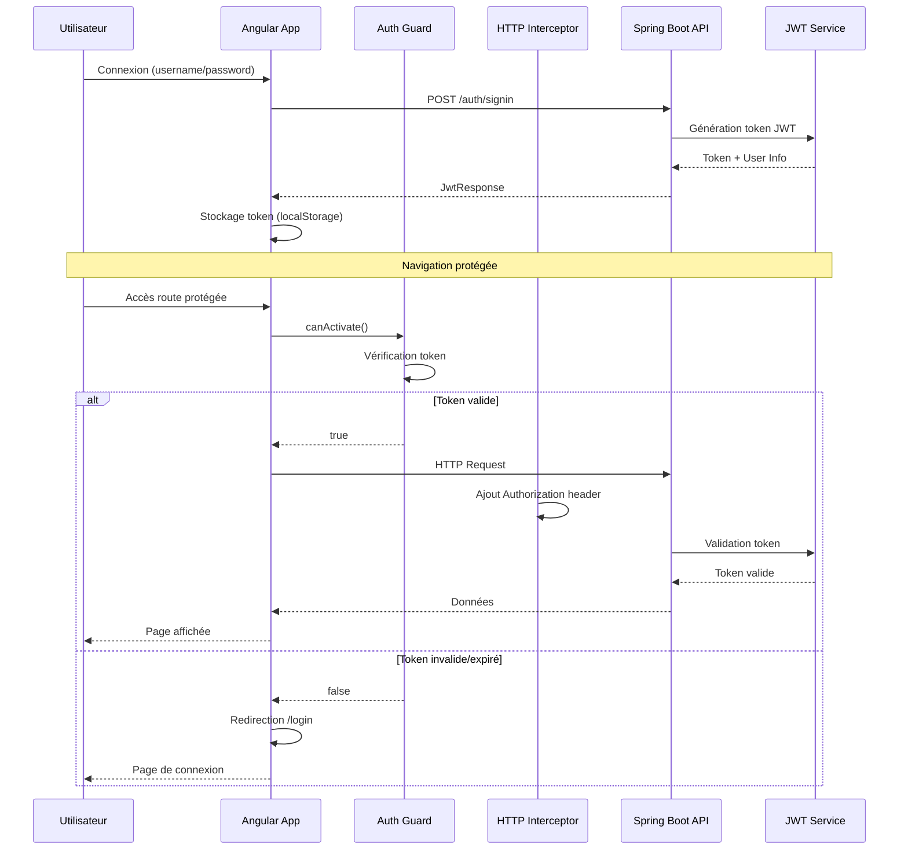

# Application de Gestion de Crédits Bancaires - Frontend Angular

**Étudiant :** Mabchour Abderrahmane
**Examen :** Rattrapage Architecture Distribuée et Middleware
**Framework :** Angular 19.2.12 + Spring Boot Backend
**Sujet :** Application de Gestion de Crédits Bancaires

---

## 📋 Table des Matières

1. [Vue d'ensemble](#vue-densemble)
2. [Architecture Frontend](#architecture-frontend)
3. [Technologies Utilisées](#technologies-utilisées)
4. [Installation et Configuration](#installation-et-configuration)
5. [Structure du Projet](#structure-du-projet)
6. [Fonctionnalités](#fonctionnalités)
7. [API Backend](#api-backend)
8. [Sécurité et Authentification](#sécurité-et-authentification)
9. [Développement](#développement)
10. [Tests](#tests)
11. [Déploiement](#déploiement)

---

## 🎯 Vue d'ensemble

Cette application Angular constitue le frontend d'un système de gestion de crédits bancaires. Elle communique avec une API REST Spring Boot pour offrir une interface utilisateur moderne et réactive.

### Règles de Gestion

- Un client peut effectuer plusieurs demandes de crédit
- Trois types de crédits disponibles : Personnel, Immobilier, Professionnel
- Un crédit peut avoir plusieurs remboursements
- Système d'authentification avec trois niveaux de rôles : CLIENT, EMPLOYE, ADMIN
- Gestion des statuts de crédit : En cours, Accepté, Rejeté

### Fonctionnalités Principales

- **Authentification JWT** avec gestion des rôles
- **Gestion des clients** (CRUD complet)
- **Demandes de crédit** avec workflow d'approbation
- **Suivi des remboursements** et échéances
- **Interface responsive** adaptée à tous les écrans
- **Sécurité avancée** avec guards et interceptors

---

## 🏗️ Architecture Frontend



---

## 🛠️ Technologies Utilisées

### Frontend

- **Angular 19.2.12** - Framework principal
- **TypeScript** - Langage de programmation
- **RxJS** - Programmation réactive
- **Angular Material** - Composants UI (recommandé)
- **Bootstrap** - Framework CSS responsive

### Backend (API)

- **Spring Boot 3.4.5** - Framework backend
- **Spring Security** - Sécurité et authentification
- **JWT** - Tokens d'authentification
- **JPA/Hibernate** - Persistence des données
- **H2 Database** - Base de données en mémoire
- **Swagger/OpenAPI** - Documentation API

### Outils de Développement

- **Angular CLI** - Outils de développement
- **Node.js & npm** - Gestionnaire de paquets
- **Git** - Contrôle de version
- **VS Code** - Éditeur recommandé

---

## 🚀 Installation et Configuration

### Prérequis

- Node.js (version 18+)
- npm (version 9+)
- Angular CLI (version 19+)
- Backend Spring Boot en cours d'exécution sur le port 8080

### Installation

1. **Cloner le projet**

```bash
git clone <repository-url>
cd frontend-exam-jee
```

2. **Installer les dépendances**

```bash
npm install
```

3. **Démarrer le serveur de développement**

```bash
ng serve
```

4. **Accéder à l'application**

```
http://localhost:4200
```

### Configuration de l'API

Modifier le fichier `src/environments/environment.ts` :

```typescript
export const environment = {
  production: false,
  apiUrl: "http://localhost:8080/api/v1",
  authUrl: "http://localhost:8080/auth",
};
```

---

## 📁 Structure du Projet

```
src/app/
├── core/                     # Services singleton, guards, interceptors
│   ├── guards/              # Route guards
│   ├── interceptors/        # HTTP interceptors
│   ├── services/            # Services globaux
│   └── models/              # Interfaces et modèles
├── shared/                   # Composants réutilisables
│   ├── components/          # Composants partagés
│   ├── pipes/               # Pipes personnalisés
│   └── directives/          # Directives personnalisées
├── features/                 # Modules fonctionnels
│   ├── auth/                # Authentification
│   │   ├── login/
│   │   └── services/
│   ├── clients/             # Gestion clients
│   │   ├── client-list/
│   │   ├── client-form/
│   │   └── services/
│   ├── credits/             # Gestion crédits
│   │   ├── credit-list/
│   │   ├── credit-form/
│   │   ├── credit-approval/
│   │   └── services/
│   └── admin/               # Administration
│       ├── user-management/
│       └── services/
└── layouts/                 # Layouts de l'application
    ├── main-layout/
    └── auth-layout/
```

---

## ⚡ Fonctionnalités

### 🔐 Authentification et Autorisation

- **Connexion JWT** avec gestion des tokens
- **Contrôle d'accès par rôles** (CLIENT, EMPLOYE, ADMIN)
- **Guards de route** pour protéger les pages
- **Intercepteurs HTTP** pour l'injection automatique des tokens
- **Déconnexion automatique** en cas d'expiration du token

### 👥 Gestion des Clients

- **Liste des clients** avec pagination et recherche
- **Ajout de nouveaux clients** avec validation des formulaires
- **Modification des informations client**
- **Suppression de clients** (avec confirmation)
- **Historique des crédits** par client

### 💰 Gestion des Crédits

- **Demande de crédit** avec formulaire dynamique selon le type
- **Types de crédits supportés :**
  - **Personnel** : avec motif
  - **Immobilier** : avec type de bien (Appartement, Maison, Local commercial)
  - **Professionnel** : avec motif et raison sociale
- **Workflow d'approbation** pour employés et admins
- **Suivi des statuts** : En cours, Accepté, Rejeté
- **Calcul automatique** des taux d'intérêt

### 📊 Suivi des Remboursements

- **Échéancier de remboursement** avec calendrier
- **Enregistrement des paiements** (Mensualité, Remboursement anticipé)
- **Historique des remboursements** par crédit
- **Calcul du solde restant** en temps réel

### 🛡️ Administration

- **Gestion des utilisateurs** (création, modification, suppression)
- **Attribution des rôles** et permissions
- **Tableau de bord administrateur** avec statistiques
- **Logs d'audit** des actions utilisateurs

---

## 🔌 API Backend

### Endpoints Principaux

#### Authentification

```
POST /auth/signin          # Connexion utilisateur
GET  /auth/user           # Informations utilisateur connecté
POST /auth/logout         # Déconnexion
GET  /auth/validate       # Validation du token
```

#### Gestion des Clients

```
GET    /api/v1/clients           # Liste des clients
GET    /api/v1/clients/{id}      # Détails d'un client
POST   /api/v1/clients           # Créer un client
PUT    /api/v1/clients/{id}      # Modifier un client
DELETE /api/v1/clients/{id}      # Supprimer un client
```

#### Gestion des Crédits

```
POST /api/v1/credits/demande              # Demander un crédit
GET  /api/v1/credits/{id}                 # Détails d'un crédit
GET  /api/v1/credits/client/{clientId}    # Crédits d'un client
PUT  /api/v1/credits/{id}/approve         # Approuver un crédit
PUT  /api/v1/credits/{id}/reject          # Rejeter un crédit
```

#### Gestion des Remboursements

```
POST /api/v1/credits/{id}/remboursements     # Ajouter un remboursement
GET  /api/v1/credits/{id}/remboursements     # Liste des remboursements
```

### Modèles de Données

#### Client

```typescript
interface Client {
  id: number;
  nom: string;
  email: string;
  dateCreation?: Date;
}
```

#### Crédit

```typescript
interface Credit {
  id: number;
  dateDemande: Date;
  statut: "EN_COURS" | "ACCEPTE" | "REJETE";
  dateAcceptation?: Date;
  montant: number;
  dureeRemboursement: number;
  tauxInteret: number;
  client: Client;
  typeCreditDiscriminator: string;

  // Spécifique au type
  motif?: string; // Personnel, Professionnel
  typeBienFinance?: TypeBienFinance; // Immobilier
  raisonSocialeEntreprise?: string; // Professionnel
}
```

#### Remboursement

```typescript
interface Remboursement {
  id: number;
  dateRemboursement: Date;
  montant: number;
  type: "MENSUALITE" | "REMBOURSEMENT_ANTICIPE";
}
```

---

## 🔒 Sécurité et Authentification

### Architecture de Sécurité



### Implémentation des Guards

#### AuthGuard

```typescript
@Injectable()
export class AuthGuard implements CanActivate {
  constructor(private authService: AuthService, private router: Router) {}

  canActivate(): boolean {
    if (this.authService.isAuthenticated()) {
      return true;
    }
    this.router.navigate(["/login"]);
    return false;
  }
}
```

#### RoleGuard

```typescript
@Injectable()
export class RoleGuard implements CanActivate {
  constructor(private authService: AuthService) {}

  canActivate(route: ActivatedRouteSnapshot): boolean {
    const requiredRoles = route.data["roles"] as string[];
    return this.authService.hasAnyRole(requiredRoles);
  }
}
```

### Intercepteurs HTTP

#### AuthInterceptor

```typescript
@Injectable()
export class AuthInterceptor implements HttpInterceptor {
  constructor(private authService: AuthService) {}

  intercept(req: HttpRequest<any>, next: HttpHandler): Observable<HttpEvent<any>> {
    const token = this.authService.getToken();

    if (token) {
      const authReq = req.clone({
        headers: req.headers.set("Authorization", `Bearer ${token}`),
      });
      return next.handle(authReq);
    }

    return next.handle(req);
  }
}
```

### Matrice d'Autorisation

| Fonctionnalité     | CLIENT   | EMPLOYE   | ADMIN     |
| ------------------ | -------- | --------- | --------- |
| Voir profil        | ✅ (soi) | ✅ (tous) | ✅ (tous) |
| Demander crédit    | ✅       | ❌        | ❌        |
| Voir ses crédits   | ✅ (soi) | ✅ (tous) | ✅ (tous) |
| Approuver crédit   | ❌       | ✅        | ✅        |
| Gérer clients      | ❌       | ✅        | ✅        |
| Gérer utilisateurs | ❌       | ❌        | ✅        |
| Administration     | ❌       | ❌        | ✅        |

---

## 💻 Développement

### Commandes Angular CLI

#### Génération de Composants

```bash
# Générer un nouveau composant
ng generate component features/clients/client-detail

# Générer un service
ng generate service core/services/auth

# Générer un guard
ng generate guard core/guards/auth

# Générer un interceptor
ng generate interceptor core/interceptors/auth

# Générer un module
ng generate module features/credits --routing
```

#### Serveur de Développement

```bash
# Démarrer le serveur de développement
ng serve

# Démarrer avec un port spécifique
ng serve --port 4201

# Démarrer avec ouverture automatique du navigateur
ng serve --open

# Démarrer avec rechargement automatique
ng serve --live-reload
```

#### Build et Optimisation

```bash
# Build de développement
ng build

# Build de production
ng build --prod

# Build avec analyse des bundles
ng build --stats-json
npx webpack-bundle-analyzer dist/stats.json
```

### Configuration des Environnements

#### environment.ts (Développement)

```typescript
export const environment = {
  production: false,
  apiUrl: "http://localhost:8080/api/v1",
  authUrl: "http://localhost:8080/auth",
  enableLogging: true,
  tokenKey: "auth_token",
  refreshTokenKey: "refresh_token",
};
```

#### environment.prod.ts (Production)

```typescript
export const environment = {
  production: true,
  apiUrl: "https://api.example.com/api/v1",
  authUrl: "https://api.example.com/auth",
  enableLogging: false,
  tokenKey: "auth_token",
  refreshTokenKey: "refresh_token",
};
```

### Services Principaux

#### AuthService

```typescript
@Injectable({
  providedIn: "root",
})
export class AuthService {
  private currentUserSubject = new BehaviorSubject<User | null>(null);
  public currentUser$ = this.currentUserSubject.asObservable();

  constructor(private http: HttpClient) {
    this.loadCurrentUser();
  }

  login(credentials: LoginRequest): Observable<JwtResponse> {
    return this.http.post<JwtResponse>(`${environment.authUrl}/signin`, credentials).pipe(
      tap((response) => {
        this.setToken(response.token);
        this.setCurrentUser(response);
      })
    );
  }

  logout(): void {
    localStorage.removeItem(environment.tokenKey);
    this.currentUserSubject.next(null);
  }

  isAuthenticated(): boolean {
    const token = this.getToken();
    return token != null && !this.isTokenExpired(token);
  }

  hasRole(role: string): boolean {
    const user = this.currentUserSubject.value;
    return user?.roles.includes(role) || false;
  }

  hasAnyRole(roles: string[]): boolean {
    return roles.some((role) => this.hasRole(role));
  }
}
```

#### ClientService

```typescript
@Injectable({
  providedIn: "root",
})
export class ClientService {
  private apiUrl = `${environment.apiUrl}/clients`;

  constructor(private http: HttpClient) {}

  getClients(): Observable<Client[]> {
    return this.http.get<Client[]>(this.apiUrl);
  }

  getClient(id: number): Observable<Client> {
    return this.http.get<Client>(`${this.apiUrl}/${id}`);
  }

  createClient(client: Omit<Client, "id">): Observable<Client> {
    return this.http.post<Client>(this.apiUrl, client);
  }

  updateClient(id: number, client: Partial<Client>): Observable<Client> {
    return this.http.put<Client>(`${this.apiUrl}/${id}`, client);
  }

  deleteClient(id: number): Observable<void> {
    return this.http.delete<void>(`${this.apiUrl}/${id}`);
  }
}
```

### Routing Configuration

#### app-routing.module.ts

```typescript
const routes: Routes = [
  { path: "", redirectTo: "/dashboard", pathMatch: "full" },
  { path: "login", component: LoginComponent },
  {
    path: "dashboard",
    component: DashboardComponent,
    canActivate: [AuthGuard],
  },
  {
    path: "clients",
    loadChildren: () => import("./features/clients/clients.module").then((m) => m.ClientsModule),
    canActivate: [AuthGuard, RoleGuard],
    data: { roles: ["EMPLOYE", "ADMIN"] },
  },
  {
    path: "credits",
    loadChildren: () => import("./features/credits/credits.module").then((m) => m.CreditsModule),
    canActivate: [AuthGuard],
  },
  {
    path: "admin",
    loadChildren: () => import("./features/admin/admin.module").then((m) => m.AdminModule),
    canActivate: [AuthGuard, RoleGuard],
    data: { roles: ["ADMIN"] },
  },
  { path: "**", component: NotFoundComponent },
];
```

---

## 🧪 Tests

### Tests Unitaires

#### Configuration Karma

```javascript
// karma.conf.js
module.exports = function (config) {
  config.set({
    basePath: "",
    frameworks: ["jasmine", "@angular-devkit/build-angular"],
    plugins: [require("karma-jasmine"), require("karma-chrome-launcher"), require("karma-jasmine-html-reporter"), require("karma-coverage"), require("@angular-devkit/build-angular/plugins/karma")],
    browsers: ["Chrome"],
    singleRun: false,
    restartOnFileChange: true,
  });
};
```

#### Exemple de Test de Service

```typescript
describe("AuthService", () => {
  let service: AuthService;
  let httpMock: HttpTestingController;

  beforeEach(() => {
    TestBed.configureTestingModule({
      imports: [HttpClientTestingModule],
      providers: [AuthService],
    });
    service = TestBed.inject(AuthService);
    httpMock = TestBed.inject(HttpTestingController);
  });

  it("should login successfully", () => {
    const mockResponse: JwtResponse = {
      token: "fake-jwt-token",
      type: "Bearer",
      id: 1,
      username: "testuser",
      roles: ["CLIENT"],
    };

    service.login({ username: "testuser", password: "password" }).subscribe((response) => {
      expect(response).toEqual(mockResponse);
    });

    const req = httpMock.expectOne(`${environment.authUrl}/signin`);
    expect(req.request.method).toBe("POST");
    req.flush(mockResponse);
  });
});
```

#### Exemple de Test de Composant

```typescript
describe("ClientListComponent", () => {
  let component: ClientListComponent;
  let fixture: ComponentFixture<ClientListComponent>;
  let clientService: jasmine.SpyObj<ClientService>;

  beforeEach(async () => {
    const spy = jasmine.createSpyObj("ClientService", ["getClients"]);

    await TestBed.configureTestingModule({
      declarations: [ClientListComponent],
      providers: [{ provide: ClientService, useValue: spy }],
    }).compileComponents();

    fixture = TestBed.createComponent(ClientListComponent);
    component = fixture.componentInstance;
    clientService = TestBed.inject(ClientService) as jasmine.SpyObj<ClientService>;
  });

  it("should load clients on init", () => {
    const mockClients: Client[] = [{ id: 1, nom: "John Doe", email: "john@example.com" }];
    clientService.getClients.and.returnValue(of(mockClients));

    component.ngOnInit();

    expect(clientService.getClients).toHaveBeenCalled();
    expect(component.clients).toEqual(mockClients);
  });
});
```

### Tests End-to-End

#### Configuration Protractor (Alternative: Cypress)

```typescript
// e2e/src/app.e2e-spec.ts
import { AppPage } from "./app.po";
import { browser, logging } from "protractor";

describe("Credit Management App", () => {
  let page: AppPage;

  beforeEach(() => {
    page = new AppPage();
  });

  it("should display login page", () => {
    page.navigateTo();
    expect(page.getTitleText()).toEqual("Application de Gestion de Crédits");
  });

  it("should login successfully", async () => {
    page.navigateTo();
    await page.login("admin", "admin123");
    expect(page.getCurrentUrl()).toContain("/dashboard");
  });
});
```

### Commandes de Test

```bash
# Tests unitaires
ng test

# Tests unitaires avec couverture
ng test --code-coverage

# Tests e2e
ng e2e

# Tests en mode watch
ng test --watch

# Tests avec navigateur headless
ng test --browsers=ChromeHeadless
```

---

## 🚀 Déploiement

### Build de Production

```bash
# Build optimisé pour la production
ng build --prod

# Build avec configuration personnalisée
ng build --configuration=production

# Vérification de la taille des bundles
ng build --prod --stats-json
npx webpack-bundle-analyzer dist/mabchour-abderrahmane-frontend-exam-jee/stats.json
```

### Configuration Nginx

```nginx
server {
    listen 80;
    server_name your-domain.com;
    root /var/www/html/dist/mabchour-abderrahmane-frontend-exam-jee;
    index index.html;

    # Gestion des routes Angular
    location / {
        try_files $uri $uri/ /index.html;
    }

    # Cache des assets statiques
    location ~* \.(js|css|png|jpg|jpeg|gif|ico|svg)$ {
        expires 1y;
        add_header Cache-Control "public, immutable";
    }

    # Proxy vers l'API backend
    location /api/ {
        proxy_pass http://localhost:8080;
        proxy_set_header Host $host;
        proxy_set_header X-Real-IP $remote_addr;
        proxy_set_header X-Forwarded-For $proxy_add_x_forwarded_for;
        proxy_set_header X-Forwarded-Proto $scheme;
    }
}
```

### Docker

#### Dockerfile

```dockerfile
# Build stage
FROM node:18-alpine AS build
WORKDIR /app
COPY package*.json ./
RUN npm ci --only=production
COPY . .
RUN npm run build --prod

# Production stage
FROM nginx:alpine
COPY --from=build /app/dist/mabchour-abderrahmane-frontend-exam-jee /usr/share/nginx/html
COPY nginx.conf /etc/nginx/nginx.conf
EXPOSE 80
CMD ["nginx", "-g", "daemon off;"]
```

#### docker-compose.yml

```yaml
version: "3.8"
services:
  frontend:
    build: .
    ports:
      - "80:80"
    depends_on:
      - backend
    environment:
      - API_URL=http://backend:8080

  backend:
    image: openjdk:17-jdk-slim
    ports:
      - "8080:8080"
    volumes:
      - ./backend:/app
    working_dir: /app
    command: java -jar exam-jee-1.0.0.jar
```

### Variables d'Environnement

```bash
# .env (pour Docker)
API_URL=http://localhost:8080
AUTH_URL=http://localhost:8080/auth
ENVIRONMENT=production
```

---

## 📚 Documentation Complémentaire

### Liens Utiles

- **Backend API Documentation :** http://localhost:8080/swagger-ui.html
- **H2 Database Console :** http://localhost:8080/h2-console
- **Angular Documentation :** https://angular.io/docs
- **Spring Boot Documentation :** https://spring.io/projects/spring-boot

### Comptes de Test

| Utilisateur | Mot de passe | Rôle    | Description            |
| ----------- | ------------ | ------- | ---------------------- |
| admin       | admin123     | ADMIN   | Administrateur système |
| employe     | employe123   | EMPLOYE | Employé bancaire       |
| client      | client123    | CLIENT  | Client bancaire        |

### Données de Test Disponibles

- **3 clients** pré-créés avec différents profils
- **5 crédits** de différents types et statuts
- **10 remboursements** répartis sur les crédits
- **3 utilisateurs** avec rôles différents

---

## 🤝 Contribution

### Standards de Code

- **ESLint** pour la qualité du code TypeScript
- **Prettier** pour le formatage automatique
- **Husky** pour les hooks Git
- **Conventional Commits** pour les messages de commit

### Workflow de Développement

1. **Fork** du repository
2. **Création** d'une branche feature
3. **Développement** avec tests
4. **Pull Request** avec description détaillée
5. **Review** et validation
6. **Merge** vers la branche principale

---

**Projet réalisé par :** Mabchour Abderrahmane
**Date :** Décembre 2024
**Durée :** 3h00
**Framework :** Angular 19.2.12 + Spring Boot 3.4.5
**Version :** 1.0.0
